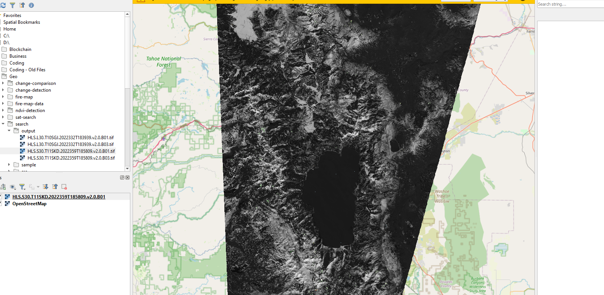

# Search, Download Granules

A script to download bands of a cloud optimized granule from the LP Cloud data center. 

The collections searched include [HLSL30.v2.0](https://lpdaac.usgs.gov/products/hlsl30v002/) and [HLSS30.v2.0](https://lpdaac.usgs.gov/products/hlss30v002/). Both collection items are multi-band cloud optimized geotiffs. More details can be found by following each collections link.

Both collections can be searched on via web thanks to [EarthData Search](https://search.earthdata.nasa.gov/search?q=hls).

## Prerequisite

To run the script, important python libraries are required.

- requests

## How to

The script can be ran from the command line or included in a project as an import.

### Command line

The python script can be ran from the command line. Two arguments are required, an input and output file path, name.

`python src/app.py {granule_id} {bands}`

**Optional arguments** include `--output`.

Including `--output` tells the app where to download the granule bands to.

#### Example

*From README directory*

`python src/app.py HLS.S30.T11SKD.2022359T185809.v2.0 B01,B03 --output output`

The geotif (`output/HLS.S30.T11SKD.2022359T185809.v2.0.B01.tif`) was download by the above command.



### Imported

Once the script is copied over to your project or built/installed with python's wheel, you can access key functions to calculate difference values of multiple geotiffs.

To access, either:

`import app`

`from app import download_feature_bands`

Once imported, these two functions can be used to determine NDVI values.

#### Example Usage

```
import app
    
if __name__ == "__main__":
    feature = {...} #feature dict
    bands = ['B01', 'B03']
    app.download_feature_bands(feature, bands, output)
```

Further documentation is included on the functions.